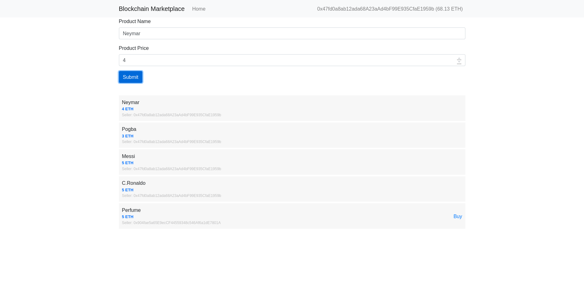
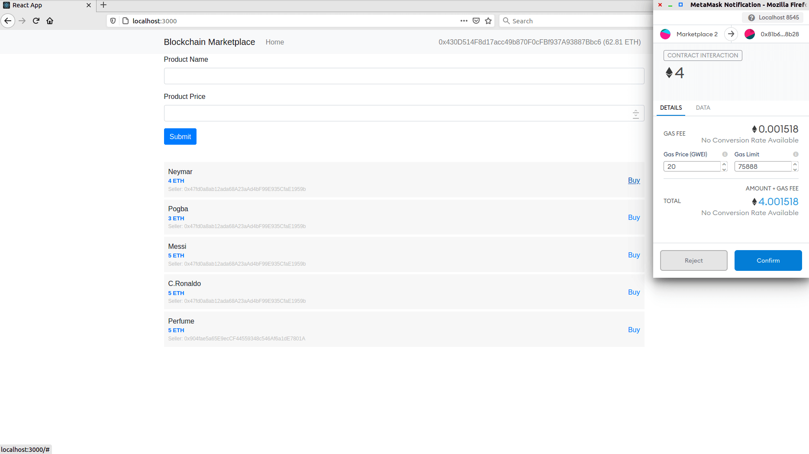
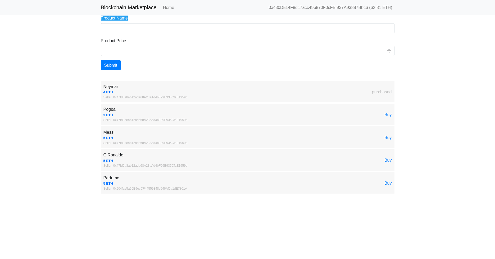

### About the project

Just a simple E-Commerce written by Ethereum Smart contract & React.js

### How to run

1. Install & run Ganache

2. Setup truffle-config.js

3. Install Metamask browser extension & import account from Ganache

4. Deploy contract

```
truffle migrate
```

5. Run client

```
cd client && npm run start
```







### How to setup this project from begin

- use create-react-app to create project

- mkdir blockchain_marketplace && cd blockchain_marketplace

- npm init react-app client

- truffle init

- truffle migrate --reset

- truffel test --show-events

### System requirements

- Node.js v12.x

- Truffle v5.1.51